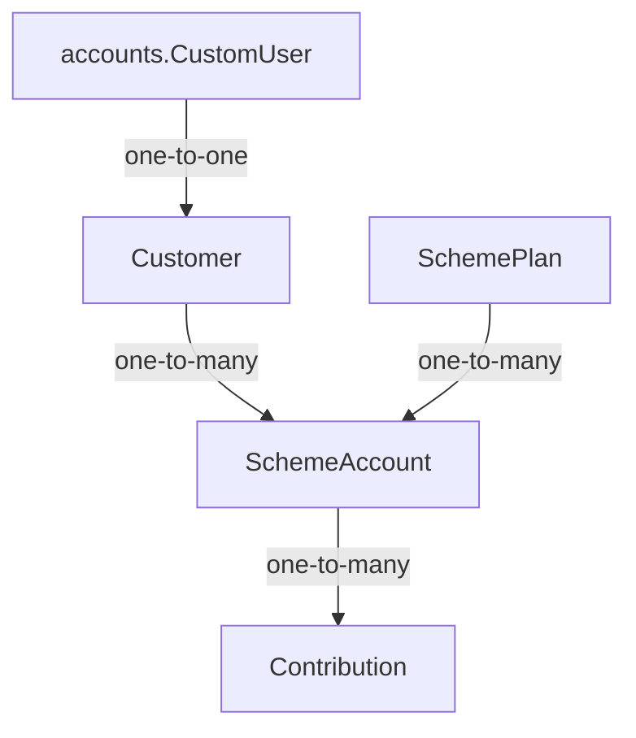

# Architecture

## System context

This is a server-rendered, single-business Django application. Customers authenticate by email through django-allauth. Owners manage customers and enrolments; customers can view only their own scheme accounts.

## Django apps

- `accounts`: Lithium's custom user, allauth integration, and simple `OWNER`/`STAFF`/`CUSTOMER` application roles.
- `pages`: public landing and about pages.
- `schemes`: customer profiles, reusable plans, scheme agreements, contributions, payment boundary, services, selectors, forms, and owner/customer views.

## Model relationships

`SchemeAccount` snapshots plan terms during enrolment so later plan edits do not change existing agreements.

## Layers

- Views authorize, validate forms, call services/selectors, and render or redirect.
- Services own transactional mutations such as customer creation and enrolment.
- Selectors own reusable reads such as customer scheme summaries.
- Models and database constraints protect structural invariants.

## Authentication and authorization

Lithium's `CustomUser` and django-allauth remain authoritative. Superusers and `OWNER` users have owner access. Customer queries are always scoped through the authenticated user's one-to-one `Customer` record.

## Financial source of truth

Cash principal is derived by selectors from `PAID` contribution records; pending and failed attempts contribute zero. Future metal and redemption balances must likewise be derived from allocations, redemptions, and auditable corrections—not mutable balance fields.

`MockPaymentGateway` is the only payment adapter currently implemented. The adapter can be resolved only when `DEBUG=True` and `PAYMENT_GATEWAY=mock`. A payment result must be verified before the contribution confirmation service changes `PENDING` to `PAID`. External payment and metal-rate providers remain deferred.

## Current request flows

Owner: login → dashboard → customers → add customer → customer detail → enrol customer.

Customer: login → My Schemes → account terms. Login routing is role-aware.

Cash contribution: customer account → Pay now → validate snapshotted amount/frequency rules → create pending contribution → verified mock result → idempotent confirmation → derived cash balance.
