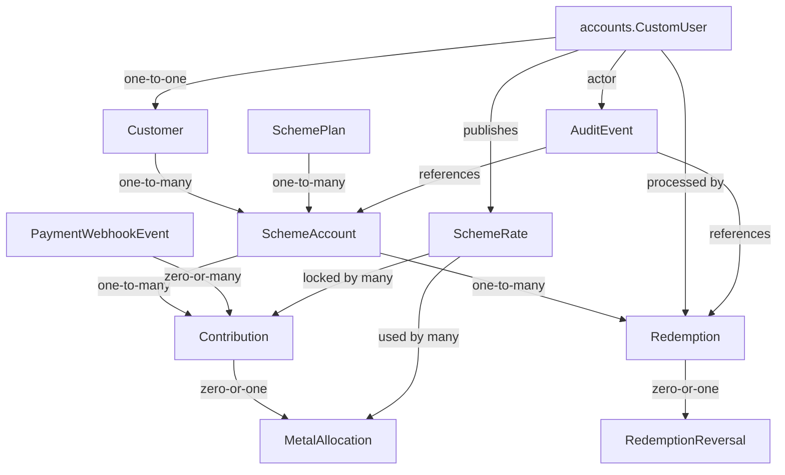

# Architecture

## System context

This is a server-rendered, single-business Django application. Customers authenticate by email through django-allauth. Owners manage customers and enrolments; customers can view only their own scheme accounts.

## Django apps

- `accounts`: Lithium's custom user, allauth integration, and simple `OWNER`/`STAFF`/`CUSTOMER` application roles.
- `pages`: Django-owned landing, policy, contact, and savings-plan views plus the
  rollout-gated Wagtail About and Our Story editorial page types. Stable Django named
  routes serve a live/public CMS revision only when explicitly enabled and otherwise
  retain the reviewed static fallback.
- `catalog`: bounded Wagtail catalogue pages, taxonomy, public discovery, and
  separately scoped catalogue authorization.
- `schemes`: customer profiles, reusable plans, scheme agreements, contributions, payment boundary, services, selectors, forms, and owner/customer views.

## Model relationships

`SchemeAccount` snapshots plan terms during enrolment so later plan edits do not change existing agreements. Cash agreements also snapshot the bonus policy version, percentage, and minimum qualifying duration.

## Layers

- Views authorize, validate forms, call services/selectors, and render or redirect.
- Services own transactional mutations such as customer creation, enrolment, and redemption.
- Selectors own reusable reads such as customer scheme summaries.
- The owner liability selector derives separate INR, gold, and silver obligations and applies current published Scheme Rates only for indicative metal exposure.
- The redemption eligibility selector partitions open accounts from their snapshotted `eligible_from` dates into non-overlapping owner forecast windows without mutating account state.
- Document selectors assemble printable receipts and lifetime statements directly from verified contributions, immutable allocation snapshots, redemptions, reversals, and current derived entitlement. They do not copy financial data into a reporting ledger.
- Models and database constraints protect structural invariants.

## Authentication and authorization

Lithium's `CustomUser` and django-allauth remain authoritative. Superusers and `OWNER` users have owner access. Customer queries are always scoped through the authenticated user's one-to-one `Customer` record.

Public customer signup is intentionally closed during the MVP. The owner creates the
customer login and profile transactionally with an unusable password. The application
then emails a one-time, time-limited setup URL whose random secret is stored only as a
SHA-256 digest. The customer chooses their own password; successful setup also records
the allauth email address as verified. Owners can replace an unused invitation, which
revokes every previous live invitation, but an activated login uses password reset.
Invitation email-provider acceptance and login activation remain separate from the
owner's explicit scheme enrolment. This prevents an allauth login from being mistaken
for an active financial agreement.

Authentication emails opt out of Postmark link/open tracking so password and invitation
URLs remain direct first-party links. Django marks token-bearing responses `no-store`
with a `strict-origin` policy: same-origin password submissions remain CSRF-verifiable,
but subresources receive no secret-bearing URL path. The production Caddy profile
excludes the token paths from access logs. The web container emits application/error logs but no second
Gunicorn access log, and a console logging filter redacts either sensitive path if a
Django CSRF warning or application error references it. An internal error log cannot
bypass the edge filter and retain the raw token.
Nonblank `CustomUser.email` values are unique case-insensitively;
the deployment preflight stops rather than guessing how to combine historical users.

Wagtail authorization is independent of application roles. Dedicated Editorial and
Catalogue groups scope page and media access to their respective content; neither an
application `OWNER` role nor membership in one CMS area grants access to the other.
The homepage, policies, contact identity, `SchemePlan`, and every financial workflow
remain Django-owned.

### Future public customer signup

If public signup is introduced later, registration must create a complete customer profile transactionally and place it in an explicit not-yet-enrolled/awaiting-approval state. Email verification, duplicate email/mobile handling, terms and privacy consent, abuse controls, and clear status language are required. Owner approval must remain mandatory before a `SchemeAccount` is created or any payment is accepted. Extend the established invitation boundary deliberately; do not merely reopen the default allauth signup form.

## Financial source of truth

Cash principal is derived by selectors from `PAID` contribution records less completed, unreversed cash redemptions; pending and failed attempts contribute zero. Gold and silver balances are derived from immutable `MetalAllocation` quantities attached one-to-one to paid contributions less completed, unreversed redemptions in the matching metal. Historical `SchemeRate`, allocation, contribution, `Redemption`, and `RedemptionReversal` records remain visible and reject application-level edits. There are no mutable balance fields.

Cash bonus is derived from immutable paid contributions and the versioned policy snapshot on the agreement. Before eligibility it is projected exposure only. At eligibility it becomes earned from principal paid by the eligibility-date cutoff. Cash redemptions store immutable principal and bonus components whose sum equals the cash settlement total; partial settlement consumes principal first. There is no mutable bonus balance field.

`MockPaymentGateway` remains available only when `DEBUG=True` and `PAYMENT_GATEWAY=mock`. `RazorpayPaymentGateway` is the external test-mode adapter. It creates orders through a fixed authenticated HTTPS API, verifies checkout HMAC signatures using the local order ID, fetches the payment server-side, and accepts only a captured payment matching the local amount and INR currency. Live key IDs are deliberately rejected.

Razorpay webhooks are a CSRF-exempt provider endpoint protected by HMAC over the untouched request body. Only `payment.captured` changes financial state. `PaymentWebhookEvent` records a payload hash and provider event ID behind a database uniqueness constraint; duplicate or out-of-order deliveries therefore re-enter the same idempotent confirmation/allocation services without creating additional entitlement. Full webhook payloads are not retained.

`SchemeRate` is the only authoritative conversion rate for gold and silver. An active owner publishes append-only, timestamped gold or silver records through a service-layer mutation and audited owner UI. Current means the latest rate for that metal whose `effective_from` is applicable. There is no mutable active flag and no external rate provider in the allocation path.

A metal contribution selects and stores its `SchemeRate` and `rate_locked_at` before mock payment initiation or Razorpay order creation. A missing current rate blocks the contribution before any payable order exists. Payment confirmation and metal allocation use separate transactions: verified metal payment is first durably `PAID_UNALLOCATED`, and allocation changes it to `PAID` only after creating at most one immutable `MetalAllocation` from the stored lock. Exceptions or process interruption therefore remain visible and retryable, while a later publication cannot affect the allocation. Owner retry reuses the original locked rate and never obtains a replacement quote.

## Current request flows

Cash bonus: plan percentage/minimum duration → versioned enrolment snapshot → projected amount before eligibility → earned amount from principal paid by the eligibility cutoff → customer and owner breakdowns. Post-eligibility contributions add principal but do not alter the matured bonus base. Cash redemption allocates principal first and earned bonus second.

Owner: login → dashboard → customers → add customer → customer detail → enrol customer.

Customer: login → My Schemes → account terms. Login routing is role-aware.

Cash contribution (mock): customer account → Pay now → validate snapshotted amount/frequency rules → create pending contribution → verified mock result → idempotent confirmation → derived cash balance.

Razorpay contribution (test): customer account → validate → lock current Scheme Rate when metal → pending contribution → server-created order → Standard Checkout → HMAC callback plus captured-payment API check and/or signed `payment.captured` webhook → idempotent confirmation → cash entitlement or one metal allocation from the lock. A once-per-month account resumes its single pending Razorpay order instead of creating parallel payable orders.

Metal contribution: owner publishes Scheme Rate → customer selects Pay now → current applicable rate is locked → payment starts and is verified → one immutable six-decimal allocation uses the lock → derived gold or silver gram balance. No published rate means no payment initiation.

Owner liability dashboard: paid cash contributions → outstanding INR principal plus earned bonus, with projected bonus exposure shown separately; paid metal allocations → separate gold/silver grams → current published Scheme Rates → separate indicative INR exposures. Projected bonus and Scheme Rates used for display do not alter historical records. Activity counters use successful payment timestamps in the India-local calendar day and month.

Eligibility: India-local current date plus each agreement's `eligible_from` snapshot → active/not-yet-eligible or redemption-eligible display state → exclusive owner windows for eligible now, days 1–30, 31–60, and 61–90. Eligibility is a read model; it does not create a redemption or persist an automatic status change.

Redemption: owner eligibility review → denomination-specific outstanding balance → allowed settlement and precision validation → account row lock → idempotency check → immutable completed redemption → derived customer/owner balances. Cash settlement stores principal and earned-bonus components. Partial redemption leaves the account eligible and open; exact final redemption stores `REDEEMED`. Jewellery purchase records a required external invoice/reference and settlement notes without creating inventory or invoicing subsystems.

Audit and exceptions: sensitive owner action → mandatory reason → transactional domain mutation → immutable `AuditEvent` with actor label, timestamp, target, and compact details. An erroneous redemption is corrected by an immutable one-to-one `RedemptionReversal`; selectors exclude reversed settlements and restore the original entitlement while both records remain visible. The owner exception queue is a read model over current `PAID_UNALLOCATED` contributions and failed `PaymentWebhookEvent` records, not a second financial ledger.

Documents: authenticated customer/owner → authorized scheme or verified contribution → selector-built statement/receipt → print-oriented HTML. Receipt references are deterministic from the paid year and immutable contribution ID; no receipt table or PDF subsystem is introduced. Owner CSV exports read the same source records and keep INR, gold grams, and silver grams in separate fields.
