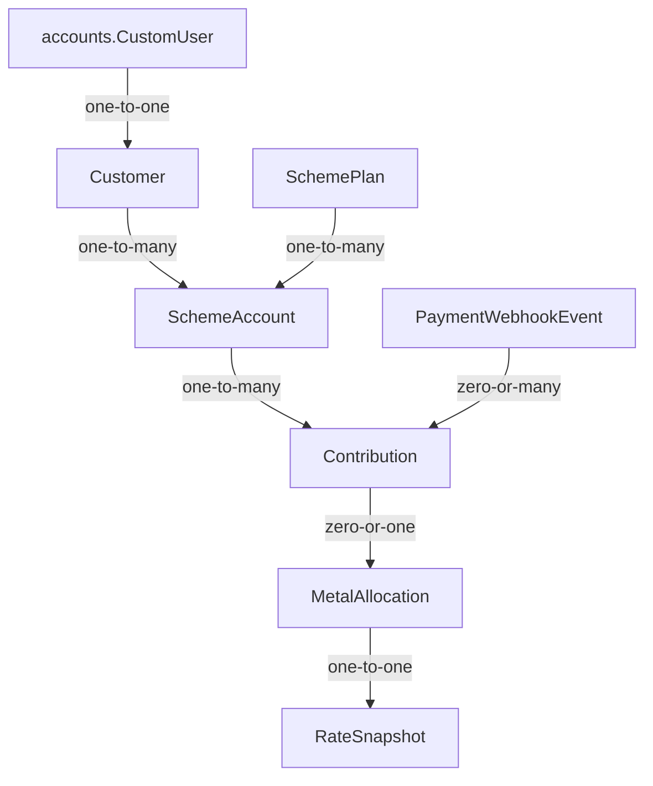

# Architecture

## System context

This is a server-rendered, single-business Django application. Customers authenticate by email through django-allauth. Owners manage customers and enrolments; customers can view only their own scheme accounts.

## Django apps

- `accounts`: Lithium's custom user, allauth integration, and simple `OWNER`/`STAFF`/`CUSTOMER` application roles.
- `pages`: public landing and about pages.
- `schemes`: customer profiles, reusable plans, scheme agreements, contributions, payment boundary, services, selectors, forms, and owner/customer views.

## Model relationships

`SchemeAccount` snapshots plan terms during enrolment so later plan edits do not change existing agreements.

## Layers

- Views authorize, validate forms, call services/selectors, and render or redirect.
- Services own transactional mutations such as customer creation and enrolment.
- Selectors own reusable reads such as customer scheme summaries.
- The owner liability selector derives separate INR, gold, and silver obligations and applies current reference quotes only for indicative metal exposure.
- The redemption eligibility selector partitions open accounts from their snapshotted `eligible_from` dates into non-overlapping owner forecast windows without mutating account state.
- Models and database constraints protect structural invariants.

## Authentication and authorization

Lithium's `CustomUser` and django-allauth remain authoritative. Superusers and `OWNER` users have owner access. Customer queries are always scoped through the authenticated user's one-to-one `Customer` record.

Public customer signup is intentionally closed during the MVP. The owner creates a customer login and profile together, then explicitly enrols that customer into a scheme agreement. This prevents an allauth login from being mistaken for an active financial agreement.

### Future public customer signup

If public signup is introduced later, registration must create a complete customer profile transactionally and place it in an explicit not-yet-enrolled/awaiting-approval state. Email verification, duplicate email/mobile handling, terms and privacy consent, abuse controls, and clear status language are required. Owner approval must remain mandatory before a `SchemeAccount` is created or any payment is accepted. Prefer an email invitation/password-setup flow before open self-registration; do not merely reopen the default allauth signup form.

## Financial source of truth

Cash principal is derived by selectors from `PAID` contribution records; pending and failed attempts contribute zero. Gold and silver balances are derived from immutable `MetalAllocation` quantities attached one-to-one to paid contributions. Historical `RateSnapshot` and allocation records reject application-level edits. Future redemption balances must likewise be derived from redemptions and auditable corrections—not mutable balance fields.

`MockPaymentGateway` remains available only when `DEBUG=True` and `PAYMENT_GATEWAY=mock`. `RazorpayPaymentGateway` is the external test-mode adapter. It creates orders through a fixed authenticated HTTPS API, verifies checkout HMAC signatures using the local order ID, fetches the payment server-side, and accepts only a captured payment matching the local amount and INR currency. Live key IDs are deliberately rejected.

Razorpay webhooks are a CSRF-exempt provider endpoint protected by HMAC over the untouched request body. Only `payment.captured` changes financial state. `PaymentWebhookEvent` records a payload hash and provider event ID behind a database uniqueness constraint; duplicate or out-of-order deliveries therefore re-enter the same idempotent confirmation/allocation services without creating additional entitlement. Full webhook payloads are not retained.

`MockMetalRateProvider` can be resolved only when `DEBUG=True` and `METAL_RATE_PROVIDER=mock`. `GoldApiMetalRateProvider` is the live implementation selected with `METAL_RATE_PROVIDER=goldapi`; it calls fixed HTTPS XAU/XAG-to-INR endpoints with header authentication, bounded timeouts, strict response validation, and a short process-local cache. Both return the same provider-neutral quote containing provider/applied rates, provider timestamp, and purity metadata.

Payment confirmation and metal allocation use separate transactions. If a verified metal payment cannot obtain or validate a quote, the contribution persists as `PAID_UNALLOCATED` with a safe current error description; it creates no `RateSnapshot` or `MetalAllocation`. The owner-only POST retry action re-enters the idempotent allocation service. A successful retry creates exactly one immutable snapshot/allocation and changes the contribution to `PAID`.

## Current request flows

Owner: login → dashboard → customers → add customer → customer detail → enrol customer.

Customer: login → My Schemes → account terms. Login routing is role-aware.

Cash contribution (mock): customer account → Pay now → validate snapshotted amount/frequency rules → create pending contribution → verified mock result → idempotent confirmation → derived cash balance.

Razorpay contribution (test): customer account → validate → pending contribution → server-created order → Standard Checkout → HMAC callback plus captured-payment API check and/or signed `payment.captured` webhook → idempotent confirmation → cash entitlement or one metal allocation. A once-per-month account resumes its single pending Razorpay order instead of creating parallel payable orders.

Metal contribution: customer account → Pay now → verified contribution → configured rate quote → immutable rate snapshot → one immutable six-decimal allocation → derived gold or silver gram balance. Rate failure branches to paid/allocation-pending → owner review → controlled retry.

Owner liability dashboard: paid cash contributions → outstanding INR principal; paid metal allocations → separate gold/silver grams → current provider quotes → separate indicative INR exposures. Reference quotes used for display do not create or alter historical allocation snapshots. Activity counters use successful payment timestamps in the India-local calendar day and month.

Eligibility: India-local current date plus each agreement's `eligible_from` snapshot → active/not-yet-eligible or redemption-eligible display state → exclusive owner windows for eligible now, days 1–30, 31–60, and 61–90. Eligibility is a read model; it does not create a redemption or persist an automatic status change.
